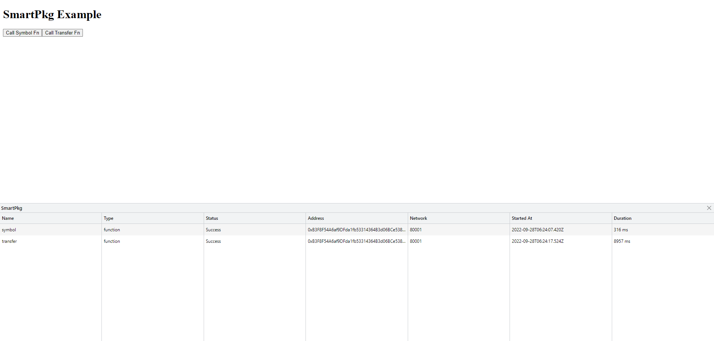
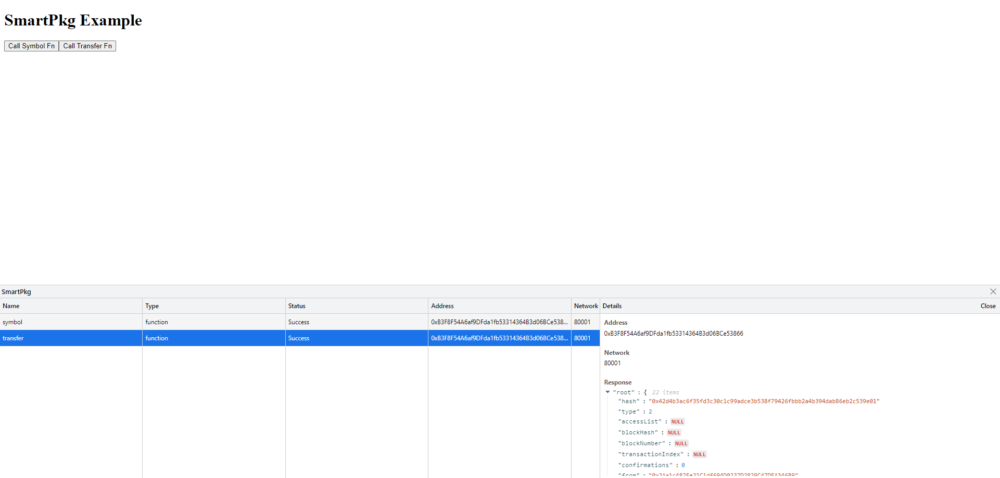

# SmartPkg
Client to get Smart Contract ABI.

## Why use SmartPkg?
We aim to improve developer experience in starting smart contract apps. Some problems we aim to solve:
* Multi-chain smart contract development
* Exploring smart contract ABI 
* Decoupling smart contract development from front/back-end development

## Installation
```bash
npm install smartpkg
```

## Usage
Here is an example of using smartpkg to get ABI.

```typescript
import { ethers } from "ethers";
import smartpkg from "smartpkg";

const chainId = 1;
const address = "0x1f9840a85d5aF5bf1D1762F925BDADdC4201F984";

const abi = await smartpkg.getAbi(chainId, address);

// Use Smart Contract
const provider = new ethers.providers.Web3Provider(window.ethereum);
await provider.send("eth_requestAccounts", []);
const signer = provider.getSigner();
const contract = new ethers.Contract(address, abi, signer);
const symbol = await contract.symbol();
console.log(symbol);
```

For getting Smart Contract ABI, 
```typescript
const abi = await smartpkg.getAbi(chainId, address);
```

For directly calling a smart contract (deployed) function without ABI,
```typescript
const contract = await smartpkg.contract(chainId, address, { signer });
const symbol = await contract.symbol();
```

For directly calling a smart contract function with ABI only,
```typescript
const contract = await smartpkg.contract(chainId, address, { abi, signer });
const symbol = await contract.symbol();
```

## SmartPkg Options

| Options        | Type               | Default   | Description                        |
|----------------|--------------------|-----------|------------------------------------|
| debug          | boolean            | true      | Debug mode                         |
| signer         | Signer or Provider | undefined | Signer or provider from ethers.js  |
| abi            | ABI                | undefined | Debug mode  |
| enableDevtools | boolean            | true      | Enable devtools or not. Install `@smartpkg/devtools` |
| enableLogging  | boolean            | true      | Enable logging or not.  |

## SmartPkg devtools
Devtools help improve understanding smart contract function calls in your DApp.

```bash
npm install @smartpkg/devtools
```

In `main.tsx`, import devtool and add the component.

```tsx
// main.tsx
import SmartpkgDevtool from '@smartpkg/devtools';

ReactDOM
  .createRoot(document.getElementById('root') as HTMLElement)
  .render(
    <React.StrictMode>
      <App />
      <SmartpkgDevtool />
    </React.StrictMode>
  );
```
### Devtools


### Devtools Details

